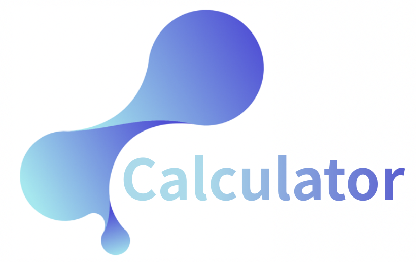
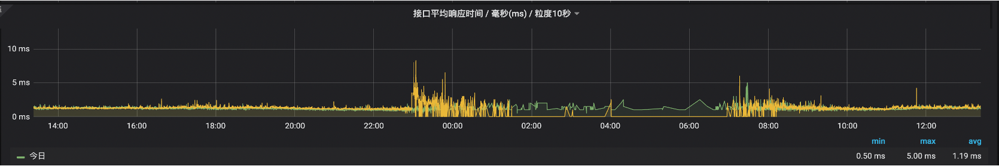
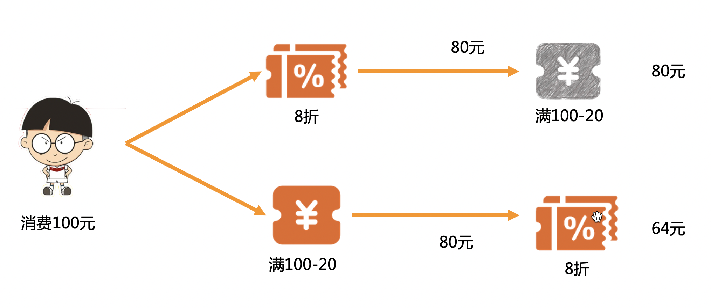
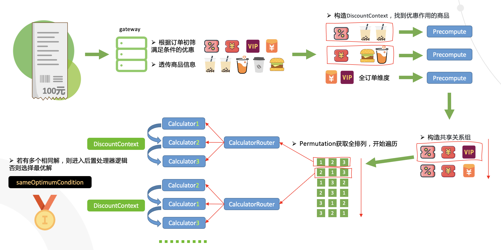

<div align=center>
  
</div>

<div align="center">
  <a href="javascript:;"></a>
  <a href="javascript:;"></a>
  <a href="javascript:;"></a>
  <a href="javascript:;"></a>
 </div>

<br />

## Stateless高性能优惠叠加计算框架

#### RT: 
 
 
 
#### 背景：

优惠是营销转化链路的重要抓手，对刺激用户消费起到至关重要的作用，目前市场上的优惠主要包含活动（如拼多多的砍一刀、天猫农场、新用户首购、复购、积分等）和券（如折扣券、代金券、商品券、买A赠B等），复杂的优惠规则让用户很难自行计算优惠叠加的顺序，或许用户在复杂的优惠规则中降低购买商品的欲望，对于参加了多个活动、有多个优惠券情况尤为明显。

优惠的计算顺序可以分为平行式和渐进式，其中平行式优惠之间没有依赖关系，而渐进式优惠之间则存在依赖关系，即下一个优惠取决于上一步的优惠结果，假设小明消费了100元，有一个8折优惠券和一个满100-20的优惠券，则这2个优惠的使用顺序有以下两种情况：





`Q-calculator`采用很多新颖的算法实现了高性能求解优惠最优排列。



#### 核心计算类 Permutation&lt;T extends GoodsItem&gt;

`Permutation`是一个抽象类，是`Q-calculator`的核心，在`Permutation`中使用了很多优化策略来保证性能，这些策略包括：

- 预存的排列数结果集

这么设计的原因是在业务场景中需要频繁的计算排列，对于某个长度的序列，其排列结果是固定的。在`Permutation`类中的`PERMUTATIONS`属性存放了7以内的排列数结果集，这里使用了`Byte`来存储，因此占用的内存空间非常小。
```Java
private final static Map<Integer,Collection<List<Byte>>> PERMUTATIONS = Maps.newHashMap();

```
这个动作在类加载即完成，如果对7不满意，可以调整`SUPPORTEDSIZE`的大小，7是我们在实现中摸出来的兼顾业务和性能的参数，大家可以根据自己的需要来调整。

```Java
public final static int SUPPORTEDSIZE = 7;

static{
      //前置计算 1-SUPPORTEDSIZE 之间所有排列组合
    for(byte i=1;i<=SUPPORTEDSIZE;i++){
       PERMUTATIONS.put((int)i,Collections2.permutations(IntStream.range(0,i).boxed().map(x->(byte)x.intValue()).collect(Collectors.toList())));
      }
  }

```

- $A_n^3$ 级别缓存

相对于传统的`Key-Value`结构，求解 $A_n^n$ 问题的缓存需要特殊设计，对一个优惠集合而言 $A_n^3$ 意味着缓存 n x (n-1) x (n-2) 条数据，默认n为7则需要缓存210条数据，兼顾内存大小和缓存带来的性能收益， $A_n^3$ 是最为合适的。

`Permutation`的成员变量`cache`来实现高性能缓存。

```Java
private final Map<Integer, CalcState<T>> cache = Maps.newHashMap();
```
可能你已经注意到，`cache`的键是`Integer`类型的，的确，通常`String`会更常用，然而在万次计算的场景下，`String`的拼接已经成了瓶颈。
为了实现高性能的键，`Permutation`通过位移对`Byte`数组的前3位进行扰动，确保键的唯一性和性能。

```Java
private static Integer calcKey(List<Byte> a){
       return  a.size()>=3?(a.get(0) << 6)+ (a.get(1) << 3) + a.get(2):0;
}
```

`Permutation`提供了保存点来实现 $A_n^3$ 级别缓存，`CalcState` 记录了计算到第3步的状态，包括当前订单优惠金额和计算过程、已享用优惠的商品等，这些属性的保存和回放`Permutation`已经帮你做好了，`Permutation`额外提供了抽象的保存和回放方法来满足你的个性化诉求。

```Java
   /**
     * 业务将状态记录到保存点
     * @param state 保存点对象
     */
    protected abstract void makeSnapshot(CalcState<T> state,DiscountContext<T> context);

    /**
     * 业务返回保存点状态
     * @param state 保存点对象
     */
    protected abstract void backToSnapshot(CalcState<T> state,DiscountContext<T> context);
```

优惠计算是有优先级的，必须保证属性`calculateGroup`值小的在前面运算，当`backToSnapshot`发生时，需要额外判断缓存中最后一个优惠和当前准备计算优惠之间的关系，若不满足则直接跳出。`checkIfWakeUpJump`方法将在缓存被使用后立刻判断是否需要继续下去。

#### 上下文类 DiscountContext&lt;T extends GoodsItem&gt;

`DiscountContext`是上下文，也是`Permutation`的成员变量，`DiscountContext`同样包含很多优化策略：

- CalcStage数组

在变更最频繁也是最重要的计算步骤对象`CalcStage`使用数组存储，该数组随着上下文创建而创建，在`Permutation`中使用

```Java
Arrays.fill(arr,null);
```

将该数组清空并让它投入下一次计算，这样一次全排列过程中，数组只会被创建一次，避免了频繁创建数组带来的性能损耗。

- 预计算

`DiscountContext`的初始化方法是静态的`create`方法，该方法将商品和优惠进行绑定，同时执行一些用户自定义的逻辑，我们称之为`预计算`，预计算的结果会被保存在`DiscountContext`的`preCompute`属性，可以在后续的计算中直接取用，一劳永逸，避免了在后续的高速迭代中做相同的事情，比如商品分组、求和等等。

#### 预计算 PreCompute&lt;T extends GoodsItem&gt;

预计算提供了接口，要使用预计算首先需要实现PreCompute接口

```Java
public interface PreCompute<T extends GoodsItem> {
    /**
     * 判断符合条件的活动类型，符合才会执行preComputeItems
     */
    Set<String> matchTypes();

    /**
     * 对商品做一些复杂集合操作
     * @param items 当前参与优惠的商品
     * @param discount 当前优惠
     * @param preCompute 存储计算的结果
     */
     void preComputeItems(List<T> items, DiscountWrapper discount, Map<String,Object> preCompute);
}
```

此外需要在资源目录下建立`calculator-core.properties`文件，配置内容如下

```Java
precompute.path=你要扫描的包
```
`PreComputeHolder`将处理所有的`PreCompute`实现类，只有`matchTypes`匹配的情况下`preComputeItems`方法才会被执行。

```Java
public class PreComputeHolder {
    public static Set<PreCompute> COMPUTES= Sets.newHashSet();
    private final static String PATH = "precompute.path";

    static{
        Properties properties = new Properties();
        try {
              properties = PropertiesLoaderUtils.loadProperties(new FileSystemResource(Objects.requireNonNull(PreComputeHolder.class.getClassLoader().getResource("calculator-core.properties")).getPath()));
        } catch (Exception ignore) {
        }
        String path = properties.getProperty(PATH);
        if(StringUtils.isNotBlank(path)){
            Reflections reflections = new Reflections(path);
            Set<Class<? extends PreCompute>> subTypes = reflections.getSubTypesOf(PreCompute.class);
            for(Class<? extends PreCompute> clazz:subTypes){
                try {
                    COMPUTES.add(clazz.newInstance());
                } catch (Exception ignore) {
                }
            }
        }
    }
}
```

#### 计算器 Calculator

`Calculator`是单个优惠的计算接口，它有`calcWarp`一个方法，负责具体的优惠计算，但`calcWarp`需要承担一些内部的事情，因此我们提供了抽象类`AbstractCalculator`实现了`calcWarp`，并最终暴露了一个更简单的`calc`方法给使用者。

`AbstractCalculator`的内容如下，`calcWarp`方法负责创建`CalcStage`，维护`CalcStage`数组等内部工作，这对使用者来说是透明的，使用者实现`calc`就好。

```Java
public abstract class AbstractCalculator<T extends GoodsItem> implements Calculator<T> {
    public long calcWarp(DiscountContext<T> context, DiscountWrapper discountWrapper, Map<Long, T> records, byte idx, int i) {
        CalcStage stage = new CalcStage();
        CalcResult cr = context.getCalcResult();
        long price= cr.getCurPrice();
        stage.setBeforeCalcPrice(price);
        price = calc(context, discountWrapper,records, price, stage);
        if(price<0){
            return price;
        }
        stage.setAfterCalcPrice(price);
        stage.setIndex(idx);
        stage.setStageType(discountWrapper.getType());
        cr.setCurPrice(price);
        if(stage.getBeforeCalcPrice()>stage.getAfterCalcPrice()) {
            cr.getCurStages()[i] = stage;
        }
        return price;
    }

    /**
     * 返回该优惠下的最终要支付的金额,若不符合则返回 prevStagePrice
     * @param context 上下文
     * @param discountWrapper 优惠信息
     * @param records 记录享受过优惠的单品，key是calculateId，这里只提供容器，添加和判断规则由使用者自行决定
     * @param prevStagePrice 上一步计算的订单的价格
     * @param curStage 当前stage
     * @return
     */
    public abstract  long calc(DiscountContext<T> context, DiscountWrapper discountWrapper, Map<Long,T> records, long prevStagePrice, CalcStage curStage);

}

```
最终用户继承`AbstractCalculator`，需要在`Component`注解中指定一个值，而`CalculatorRouter`将通过这个值来路由到具体的优惠计算器。这个值和`DiscountWrapper`中的`type`属性是对应的。

```Java
@Component("manjian")
public class ManjianCalc extends AbstractCalculator<GoodsItem> {
......
}
```


#### 共享互斥协议 DiscountGroup

共享互斥协议是一个数组，数组中最多有2个对象，最少1个对象，若只有1个对象，则该对象必然为共享组，即组内优惠可以叠加使用
```JavaScript
[
    {
        "relation": "share",
        "items":
        [
            {
                "type": "activity0",
                "id": "11"
            }
            ,
            {
                "type": "activity4",
                "id": "13"
            } 
            ,
            {
                "type": "coupon1",
                 "id": "14"
            }
        ]
    }]
```
相应地，数组中包含2个对象，则第1个对象的`relation`可以为`share`或者`exclude`，第二个对象的`relation`必须为`exclude`

```JavaScript
[
    {
        "relation": "share",
        "items":
        [
            {
                "type": "activity0",
                "id": "11"
            },
            {
                "type": "card3",
                "id":"12"
            }
        ]
    },
    {
        "relation": "exclude",
        "items":
        [
            {
                "type": "card1",
                "id": "18"
            },
            {
                "type": "coupon1",
                "id": "22"
            }
        ]
    }
]
```
最终将转化为共享组，比如上面的协议将转化为下面2个共享组

`activity0-card3-card1`   
`activity0-card3-coupon1`

工具类 `DiscountGroupUtil` 提供了协议转共享组的方法，由于共享组可能很长，所以先和用户当前订单可享的优惠进行一个交叉过滤，为了提升过滤的性能，要将当前可用优惠转成二级`Map`，这个`Map`的外层键是协议中的`type`，第二层键是协议中的`id`。

```Java
public static List<Pair<Set<DiscountWrapper>,Set<DiscountWrapper>>> transform(List<List<DiscountGroup>> groups, Map<String, Map<String,DiscountWrapper>> inMap);
```
为了保证算力，我们将用户本单可享的优惠分别装在2个集合中，左侧集合的大小为`SUPPORTEDSIZE`，也就是算力之内的、重点保障的优惠，而右侧的集合则尽力而为去叠加即可。  
从稳定性角度来讲，我们需要给计算次数做一个统计，并在压测中摸清楚阈值，我们提供了`LimitingUtil.count`统计进入`calc`方法的次数，显然在没有开启缓存的情况下，计算次数为 $A_n^n$ x n，在开启缓存的情况下，计算次数为 $A_n^n$ x (n-3) + $A_n^3$

#### CASE

看了这么多概念，我们可以在`cn.qmai.discount.demo`找到调用的具体case

```Java
@Controller
public class TestController {

    private final CalculatorRouter calculatorRouter;

    public TestController(CalculatorRouter calculatorRouter) {
        this.calculatorRouter = calculatorRouter;
    }

    @RequestMapping("test")
    @ResponseBody
    public Object test() {
        //mock商品
        List<GoodsItem> items = mockItems();
        //mock组关系并转化为共享组
        List<Pair<Set<DiscountWrapper>,Set<DiscountWrapper>>> pairs = transform(mockGroups());
        //全局最优计算过程
        List<CalcStage> globalStages=Lists.newArrayList();
        int count = 0;
        //订单总金额
        long totalPrice = items.stream().mapToLong(GoodsInfo::getSalePrice).sum();
        long globalPrice = totalPrice;
        //构建计算流
        Flowable flowable = (Flowable) new Flowable().build(calculatorRouter);
        for(Pair<Set<DiscountWrapper>,Set<DiscountWrapper>> set:pairs) {
            //统计算力
            count += LimitingUtil.count(set.getLeft().size());
            if(count>N){
                break;
            }
            List<DiscountWrapper> wrappers = Lists.newArrayList(set.getLeft());
            DiscountContext<GoodsItem> ctx = DiscountContext.create(totalPrice, Lists.newArrayList(items), wrappers);
            flowable.perm(ctx);
            if(ctx.getCalcResult().getFinalPrice() < globalPrice) {
                globalStages = Arrays.asList(ctx.getCalcResult().getStages());
                globalPrice = ctx.getCalcResult().getFinalPrice();
            }
        }
        return Pair.of(globalPrice,globalStages);
    }

    private List<List<DiscountGroup>> mockGroups(){
        List<List<DiscountGroup>> groups = Lists.newArrayList();
        DiscountGroup group = new DiscountGroup();
        group.setRelation(GroupRelation.SHARE.getType());
        group.setItems(Lists.newArrayList(new Item("zhekou","1"),new Item("manjian","2"),new Item("manzeng","3")));
        groups.add(Lists.newArrayList(group));
        return groups;
    }

    private List<GoodsItem> mockItems(){
        IdGenerator idGenerator = IdGenerator.getInstance();
        GoodsInfo goodsInfo = GoodsInfo.of(1001L,2001L,null,4,20 * 100,"产品1",null);
        GoodsInfo goodsInfo2 = GoodsInfo.of(1001L,2002L,null,2,10 * 100,"产品1",null);
        List<GoodsItem> items = GoodsItem.generateItems(goodsInfo,idGenerator,x->x.getExtra().put(Constant.UPDATEABLEPRICE,x.getSalePrice()));
        items.addAll(GoodsItem.generateItems(goodsInfo2,idGenerator,x->x.getExtra().put(Constant.UPDATEABLEPRICE,x.getSalePrice())));
        return items;
    }

    private List<Pair<Set<DiscountWrapper>,Set<DiscountWrapper>>> transform(List<List<DiscountGroup>> groups){
        List<DiscountWrapper> wrapperList = Lists.newArrayList(
                DiscountWrapper.of("zhekou", "1", "折扣", false, new DiscountConfig()),
                DiscountWrapper.of("manjian", "2", "满减", false, new DiscountConfig())
        );
        Map<String, Map<String,DiscountWrapper>> inMap = wrapperList.stream().collect(Collectors.toMap(DiscountWrapper::getType, x->ImmutableMap.of(x.getId(),x)));
        return DiscountGroupUtil.transform(groups,inMap);
    }

}

```


